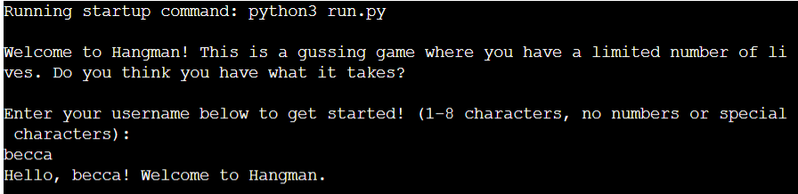
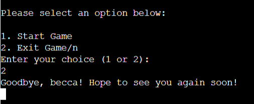
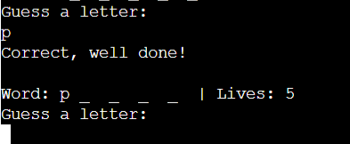
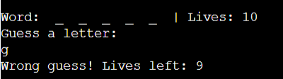
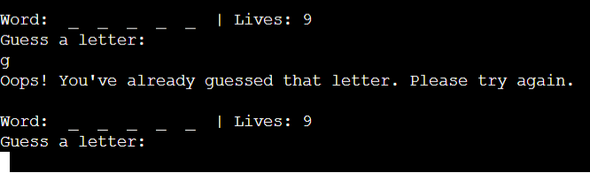
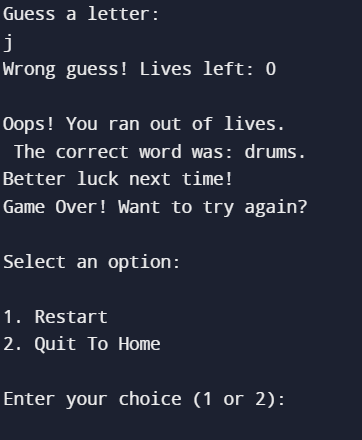
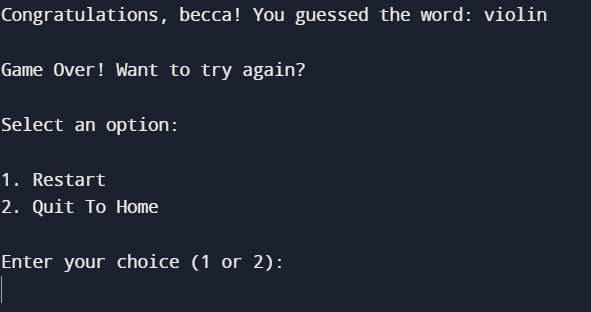
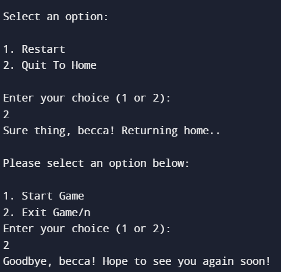

# Hangman Game
[View the live site here]( https://hangman-game-pp3-deb9aac8daff.herokuapp.com/)

## Mockups

## Introduction
For my PP3, I have made a basic hangman game. The aim of the game is to guess the word within 10 guesses. 
# Game Features
## Username Feature
Upon visiting the site, the user is met with a welcome message and username prompt. This username must meet the specific criteria or else the user will receive an error message and the game will not begin. Once the username meets the stated criteria, the game options are presented. 

## Game Options
There are two options to choose from before the game begins, start and exit. 
### Exit 
If the user chooses to exit the game, a goodbye message is displayed and no further options are presented. 

### Start 
If the user chooses to start the game, the below features are implemented; 
-	Game Hint 
The game tells the user that the words are based on musicial instruments. This is the only hint that the user is given throughout the game. 
-	Lives 
The user is told they have 10 lives before the game begins. 
The game is now ready to begin. 
## Game Play 
The user is presented with the letter count of the word they must guess and the amount of lives they have remaining. Once the user selects their first letter, the following features are implemented: 
-	Correct Guess 
If the user guesses a letter correctly, that letter replaces the corresponding blank space in the word, no lives lost. It then allows the user to guess again. 

-	Incorrect Guess 

If the user guesses incorrectly, they are presented with an error message and their remaining life count. 

-	Letter Previously Guessed 
If the user guesses a letter they have previously chosen, they are presented with an error message and asked to try again. The life count remains the same. 

-	Lives Lost 
If the user loses their lives before the word is guessed, they are met with a condolence message and the option to restart or exit the game.

### Game Won 
If the user guesses the word without losing all of their lives, they have won the game. 
Once the word is guessed – the user is presented with a congratulations message and confirmation of the guessed word. 

They are then given two options, restart or return home. Restart will restart the whole game and return to home will prompt the user to exit which will give a goodbye message to the user. 

## Features left to implement 
In the future, I would like to add the option of a hint for the user and also different levels of difficulty. 

## Testing 
I tested my code by using Synk. It can be found here - https://snyk.io/code-checker/python/ 
I wanted to use PEP8 but it was redirecting me to another site which was not letting me test my code.
 
### Manual Testing
- Feature Testing

Feature | Outcome | Pass/Fail  
--- | --- | ---
Username Too Long | Error message received.| Pass
No Username Entered| Error message received | Pass
Special Characters In Username | Error message received.| Pass
Numbers In Username | Error message received. | Pass
Username criteria met| No error message, game proceeds | Pass
Exit game selected| game ends  | Pass
Start game selected | game starts | Pass
Correct letter guessed | letter replaces blank space | Pass
Incorrect letter guessed | error message, -1 in lives, game resumes | Pass
No letter guessed | Error message received | Pass
Number or special character entered instead of letter | Error message received | Pass 
Two or more letters guessed | Error message received | Pass 
Game won | Congratulations message received and restart/quit options presented | Pass
Game Lost | Sorry message received and restart/return options presented | Pass
Restart game | Game restarts from beginning | Pass
Return Home | Game returns to start screen | Pass 
Quit Game | Game quits, script ends | Pass 
Invalid input in restart, return or quit | Error message received, option presented again | Pass 

### Bugs
I had an issue with the game running due to unorganised code. I fixed this by organising the code in the way the game was ran – this fixed the issue for me. 
I also has an issue with printing ‘Correct well done’ to the console. Each time a letter was guessed, it would print correct to the console even if the answer was incorrect. I took out this message so the game would function properly. 
As far as I am aware, there are no unfixed bugs in this project. 

## Technology 
1. Github for storing and version control. 
2. Gitpod for editing code. 
3. Heroku for deployment. 
4. Fireshot for screenshots. 
5. Python Cheat Sheet - https://www.pythoncheatsheet.org/
6. CI Course Material. 
7. Synk for testing. 
8. https://www.programiz.com/python-programming/online-compiler/ For testing code before entering to gitpod to ensure it worked. 

## Deployment 
1. Log into Heroku website or create a free account if you dont have one. 
2. Click 'new' on the top right of the dashboard then click 'create new app'. 
3. Choose a unique app name and the region you're in - when happy, click 'create app'. 
4. In the next page, choose 'settings'. 
5. Set two config vars - CREDS.json & PORT (key) 8000 (value). 
6. Add two buildpacks, Python & nodejs - in this order only. 
7. Navigate to the deploy tab and connect your github account. 
8. At the bottom of the page, choose 'Manual Deploy'from the main branch. 
9. Click 'Deploy Branch'. 

This will take a minute or two and your project is deployed. You can choose to enable automatic depolys if you wish also. 

